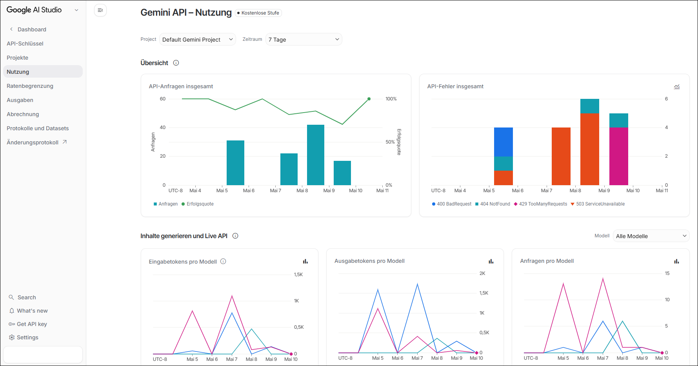

# Demo-Projekt für Gemini-Anfrage mit Nodejs #

<br>

| Beschreibung | Quelltext | NPM-Befehl |
| --- | --- | --- |
| Titelvorschläge für eingegebenen Text (REST) | [main_titel.js](src/main_titel.js) | `npm start` |
| Antwortoptionen für Multiple-Choice-Frage ([Library](https://www.npmjs.com/package/@google/genai))| [main_antwortoptionen.js](src/main_antwortoptionen.js) | `npm run mc` |
| Liste der Gemini-Modelle (REST) | [list-models.js](src/list-models.js) | `npm run liste` |
| Proxy für REST-Calls | [proxy.js](src/proxy.js) | `npm run proxy` |

<br>

**Referenzen:**

* https://aistudio.google.com/
* https://aistudio.google.com/usage?timeRange=last-28-days
* https://ai.google.dev/gemini-api/docs/pricing?hl=de

<br>


----

## API-Key ##

<br>

In *AI Studio* kann über den Eintrag "Get API Key" in der Leiste links ein API-Key erzeugt werden.
Es muss dann eine Umgebungsvariable `GEMINI_API_KEY` mit diesem API-Key gesetzt werden.

Beispiel für Windows:
```
@set GEMINI_API_KEY=....
```

Diesen `set`-Befehl kann man in eine Batch-Datei `setApiKeyEnv.bat` schreiben, da der Name dieser Batch-Datei in
[.gitignore](.gitignore) eingetragen ist.

<br>

Das Repo enthält auch ein Programm [proxy.js](src/proxy.js), das einen HTTP-Request den Header mit dem API-Key hinzufügt.
Dadurch wird vermieden, den API-Key im Frontend-Code (z.B. Ionic/Angular) abzulegen, wo er von Angreifern relativ einfach
ausgelesen werden kann.

<br>

----

## Screenshots ##

<br>



<br>